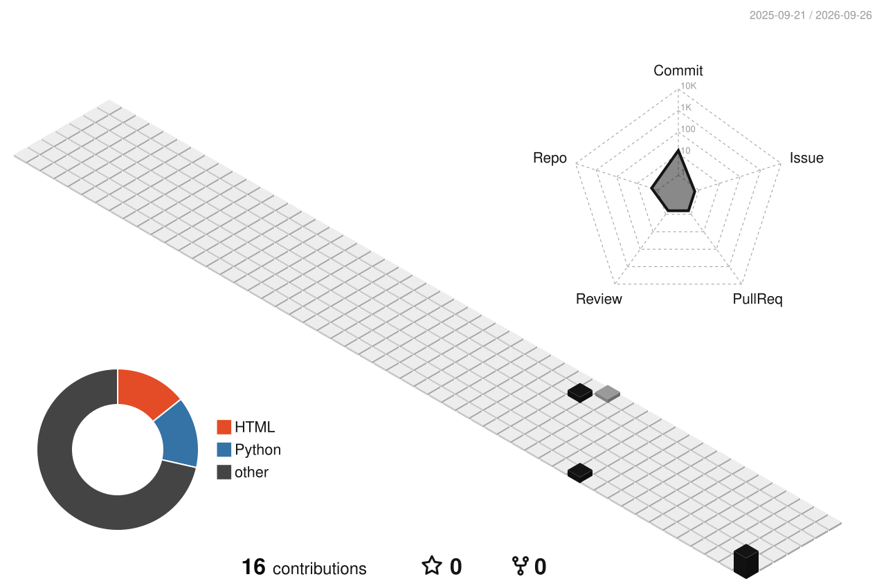

 
   
 
무엇을 만드나
LLM이 여러 단계를 스스로 밟아 일을 끝내는 애플리케이션을 만듭니다. 질문에 답하는 챗봇이 아니라, 툴을 골라 쓰고 중간에 틀리면 되돌아오는 쪽입니다.

<table width="100%"> <tr> <td width="33%" valign="top">
에이전트 설계
툴 경계 나누기  멀티스텝 플래닝  상태 관리

 </td> <td width="33%" valign="top">
서빙
FastAPI 비동기 처리  스트리밍 응답  툴 병렬 실행

 </td> <td width="33%" valign="top">
관측
실행 트레이싱  실패 지점 추적  동작 재현

 </td> </tr> </table> 
스택

     
 
      
 
잔디

  
 
어떻게 접근하나
에이전트의 성패는 프롬프트보다 그 주변 구조에서 갈린다고 봅니다.

툴을 어디서 끊을지, 실패했을 때 어디로 돌아갈지, 컨텍스트에 무엇을 남길지 — 데모와 서비스의 차이는 대부분 여기서 생깁니다.

 <!-- 공개 리포가 생기면 살리세요. 프로필에서 가장 힘이 센 자리입니다. ## 만든 것 <table width="100%"> <tr> <td width="50%" valign="top"> ### [repo-name](https://github.com/kyeonghun-kim/repo-name) 어떤 문제를 어떻게 풀었는지 한 줄. `Python` `FastAPI` `LangGraph` </td> <td width="50%" valign="top"> ### [repo-two](https://github.com/kyeonghun-kim/repo-two) 어떤 문제를 어떻게 풀었는지 한 줄. `Python` `PostgreSQL` </td> </tr> </table>  --> 
 에이전트 이야기라면 언제든 환영입니다 &nbsp;·&nbsp; <a href="mailto:kyeonghun.dev@gmail.com">kyeonghun.dev@gmail.com</a> 

