  
  

## Forward Deployed Engineer · AI Agents · Backend

그럴듯한 것보다, 쓸모 있는 것들을 만드는 FDE입니다.
현업의 문제를 가까이에서 이해하고, AI와 백엔드 개발로 업무에 필요한 도구를 만듭니다.

## 스택

  
  
  
  

  
  
  
  
  

## 잔디

<picture>
  <source media="(prefers-color-scheme: dark)" srcset="assets/snake-dark.svg">
  
</picture>

<!--
공개 리포가 생기면 살리세요. 프로필에서 가장 힘이 센 자리입니다.

## 만든 것

<table width="100%">
<tr>
<td width="50%" valign="top">

### [repo-name](https://github.com/kyeonghun-kim/repo-name)
어떤 문제를 어떻게 풀었는지 한 줄.

`Python` `FastAPI` `LangGraph`

</td>
<td width="50%" valign="top">

### [repo-two](https://github.com/kyeonghun-kim/repo-two)
어떤 문제를 어떻게 풀었는지 한 줄.

`Python` `PostgreSQL`

</td>
</tr>
</table>

-->

  AI와 현업 사이의 문제라면 언제든 환영입니다 &nbsp;·&nbsp; <a href="mailto:kyeonghun.dev@gmail.com">kyeonghun.dev@gmail.com</a>

